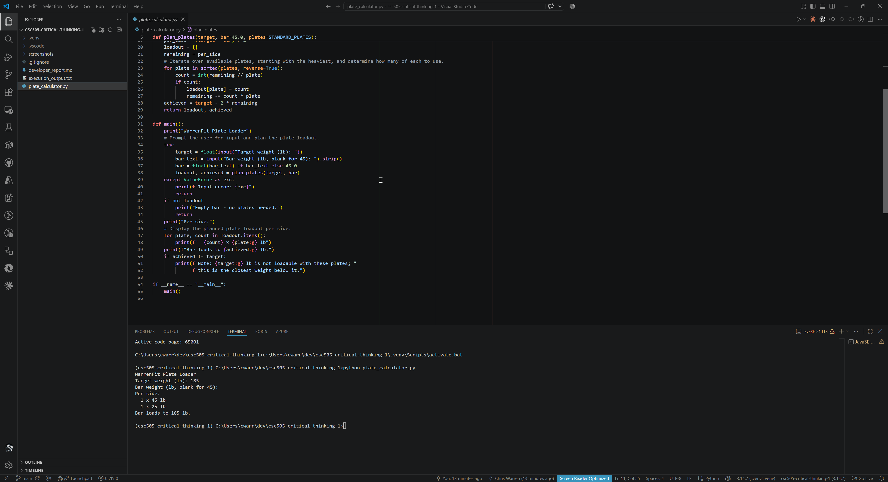

# Developer Report: Plate Loading Calculator

**Course:** CSC505 – Module 1 Critical Thinking

**Author:** Chris Warren

**Script:** `plate_calculator.py`

## What was the purpose or intended use case of your script?

The script calculates which weight plates to load on each side of a barbell to reach a target total weight, a feature I plan to carry into the WarrenFit fitness app. When a target cannot be loaded exactly with standard plates, it returns the closest loadable weight below the target and tells the user so, rather than rejecting the input.

## What tools or libraries did you use, and why?

I wrote the script in Python 3 using only the standard library (Python Software Foundation, 2025a), since the problem is arithmetic and input handling and adding dependencies would not have earned their cost. Plate weights are exact binary fractions (45, 35, 25, 10, 5, 2.5), so plain floats are safe here and avoided the overhead of `decimal` (Python Software Foundation, 2025b). I used VS Code with the debugpy launch configuration to step through the loading loop (Microsoft, n.d.), and Git for version control (Chacon & Straub, 2014).

## What challenges did you encounter during development?

The main challenge was realizing that the greedy heaviest-first approach, while always producing a valid loadout, does not always minimize plate count; for example, a 165 lb target yields 45 + 10 + 5 per side when 35 + 25 would do. Handling unloadable targets (such as 137.7 lb) also forced a design decision between raising an error and degrading gracefully, and I chose the latter because a lifter still needs a usable answer. Keeping the `ValueError` handling in one place covered both bad numeric input and out-of-range weights without duplicating checks.

## How would you expand or improve this prototype in future iterations?

The next iteration should account for a limited plate inventory (how many pairs of each size are actually available), which matches the equipment model in the full application, and add a kilogram mode. Replacing the greedy selection with a dynamic-programming pass would guarantee the fewest plates, since greedy choice is only optimal for denomination sets with a specific structure (Cormen et al., 2022). Separating `plan_plates()` from the CLI already positions the logic to sit behind an API endpoint with unit tests.

## What lessons did you learn that apply to broader software development work?

An algorithm that produces correct output is not necessarily optimal, and it is worth testing edge cases beyond the happy path before calling something done. Choosing the simplest data type the problem allows (floats here, but never for currency) keeps code readable without sacrificing correctness. Finally, documenting a prototype's known limitations is part of an honest handoff, not a weakness in it.

## Sample Execution

The screenshot below shows the script running in the VS Code integrated terminal with the project's virtual environment active. For a 185 lb target with the default 45 lb bar, the calculator plans one 45 lb and one 25 lb plate per side and confirms the bar loads to exactly 185 lb.

## References

Chacon, S., & Straub, B. (2014). *Pro Git* (2nd ed.). Apress. https://git-scm.com/book/en/v2

Cormen, T. H., Leiserson, C. E., Rivest, R. L., & Stein, C. (2022). *Introduction to algorithms* (4th ed.). MIT Press.

Microsoft. (n.d.). *Python debugging in VS Code*. Visual Studio Code Docs. Retrieved September 13, 2026, from https://code.visualstudio.com/docs/python/debugging

Python Software Foundation. (2025a). *The Python standard library* (Python 3 documentation). https://docs.python.org/3/library/

Python Software Foundation. (2025b). *Floating-point arithmetic: Issues and limitations* (Python 3 documentation). https://docs.python.org/3/tutorial/floatingpoint.html
